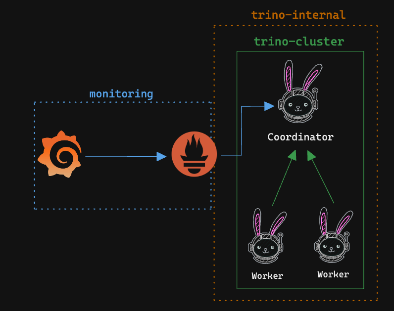
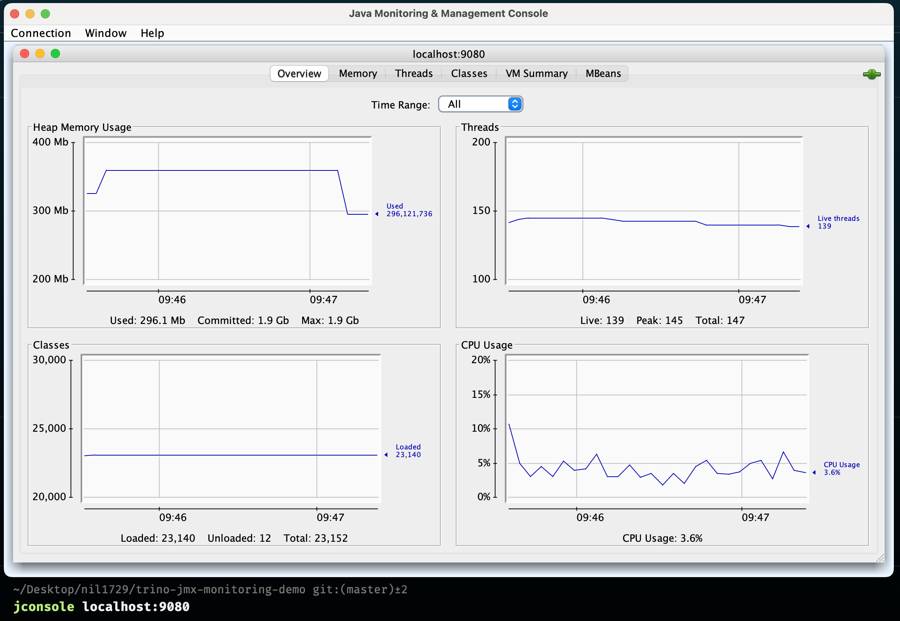
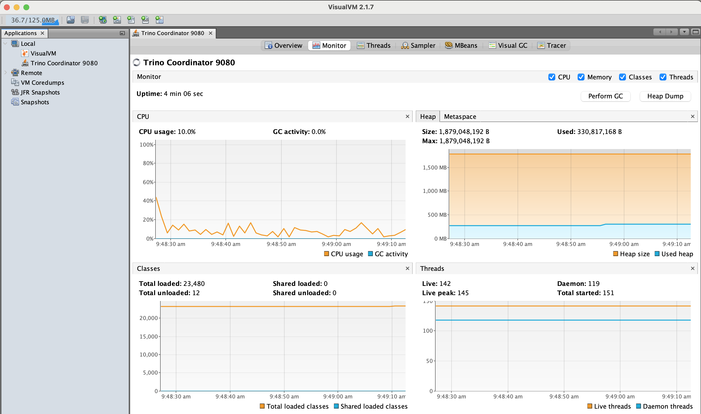
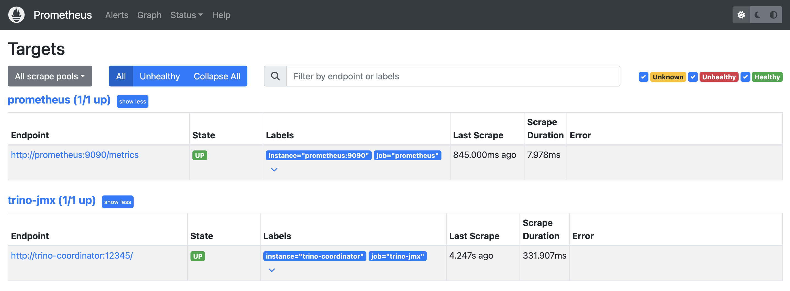
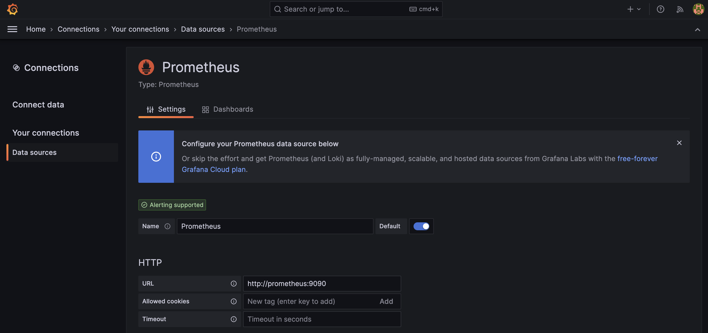
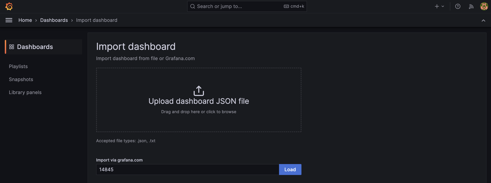
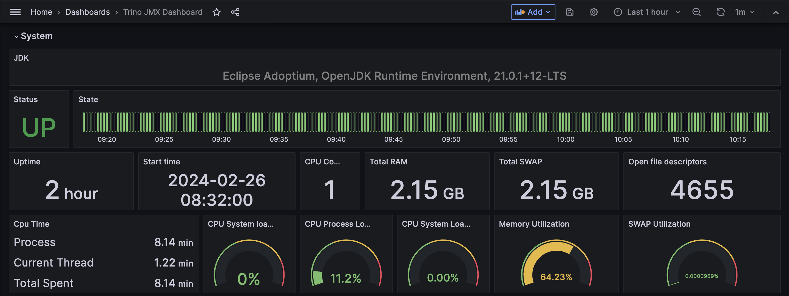
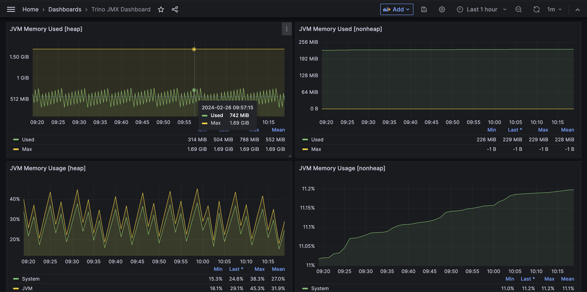

## Trino Monitoring (JMX) with Prometheus and Grafana

This repository guides you through the process of setting up monitoring for Trino JMX metrics using Prometheus and Grafana.

### Considerations

- This integration is based on the [Trino JMX metrics](https://trino.io/docs/current/monitoring-metrics.html) and the [Prometheus JMX exporter](https://github.com/prometheus/jmx_exporter)
- Trino Version: 433, Prometheus Version: 2.50.0, Grafana Version: 9.5.15

### Architecture (Docker)



### Running Trino Cluster Locally

#### Prerequisites

- Please make sure you have minimum of **8GB RAM** and **4 CPU cores** available on your machine to run the Trino cluster locally. Or you can modify the `.env` file to reduce the memory and CPU requirements.

#### Running Trino Cluster

Please modify the `.env` file to adjust the memory and CPU requirements. For this illustration, memory limit is set to `2GB` and CPU limit is set to `0.5`. If you have changed the memory, please make sure to update the `jvm.config` file with the new memory. Read more about [JVM Configuration](https://trino.io/docs/current/installation/deployment.html#jvm-config) for Trino.

```config
-Xms1792M
-Xmx1792M
```

Now, start the Trino cluster using the following command.

```bash
docker-compose up trino-coordinator trino-worker -d
```

#### Setting up JMX configuration

Please follow this [official guide](https://trino.io/docs/current/admin/jmx.html) to understand monitoring Trino using JMX.

```properties
# config.properties

jmx.rmiregistry.port=9080
jmx.rmiserver.port=9080
```

#### JVM Configuration for JMX

```config
# jvm.config

-Dcom.sun.management.jmxremote
-Dcom.sun.management.jmxremote.port=9080
-Dcom.sun.management.jmxremote.rmi.port=9080
-Dcom.sun.management.jmxremote.local.only=false
-Dcom.sun.management.jmxremote.authenticate=false
-Dcom.sun.management.jmxremote.ssl=false
-Djava.rmi.server.hostname=127.0.0.1
```

#### Monitoring JMX Metrics through JConsole

If you are running the Trino cluster locally on your machine, you can monitor the JMX metrics using JConsole.

```bash
jconsole localhost:9080
```



#### Monitoring JMX Metrics through VisualVM



#### Monitoring JMX Metrics - Cluster running on Remote VM

If you are running the Trino cluster on a remote VM, you can monitor the JMX metrics using JConsole by setting up an SSH tunnel.

```bash
ssh -L 127.0.0.1:9080:127.0.0.1:9080 {{user}}@{{remote-ip}}
```

#### JMX Exporter Configuration

To export the JMX metrics to Prometheus, we need to configure the JMX exporter. Please refer to this [guide](https://github.com/prometheus/jmx_exporter) for more details on JMX exporter.

```shell
FROM trinodb/trino:433
USER root
# jmx prometheus exporter jar
RUN curl -L https://repo1.maven.org/maven2/io/prometheus/jmx/jmx_prometheus_javaagent/0.20.0/jmx_prometheus_javaagent-0.20.0.jar -o /usr/lib/trino/lib/jmx_prometheus_javaagent.jar
USER trino
```

```yaml
# config.yaml (jmx exporter config)

rules:
  - pattern: ".*"
```

JVM Configuration for JMX Exporter

```config
-javaagent:/usr/lib/trino/lib/jmx_prometheus_javaagent.jar=12345:/etc/trino/jmx/config.yaml
```

Now restart the Trino cluster to apply the JMX exporter configuration. Once the cluster is up and running, you can access the JMX metrics using the following URL.

```txt
http://localhost:12345/metrics
```

#### Prometheus Configuration

```yaml
# prometheus.yml

scrape_configs:
  - job_name: "trino-jmx"
    metrics_path: "/metrics"
    scrape_interval: 5s
    static_configs:
      - targets: ["trino-coordinator:12345"]
        labels:
          instance: "trino-coordinator"
```

#### Start the Prometheus Server

```bash
docker-compose up prometheus -d
```

#### Access Prometheus UI

Open the Prometheus UI and check the targets to see if the Trino JMX metrics are being scraped.

```txt
http://localhost:9090/targets
```



#### Start the Grafana Server

```bash
docker-compose up grafana -d
```

#### Access Grafana UI

You can access Grafana UI at http://localhost:3000 with the following credentials.

- Grafana Username: `admin`
- Grafana Password: `password`

You can change the password in the `.env` file.

#### Grafana Data Source Configuration

Open the Grafana UI and configure the `Prometheus` data source.

```txt
http://localhost:3000/connections/your-connections/datasources
```



#### Grafana Dashboard Configuration

Import the `JMX Dashboard(Basic)` using the dashboard ID `14845`. [Grafana Dashboard](https://grafana.com/grafana/dashboards/14845-jmx-dashboard-basic)

```txt
http://localhost:3000/dashboard/import
```



#### Trino JMX Metrics Dashboard




---

### Troubleshooting

1. [JMX Metrics in Docker Container.](https://github.com/cstroe/java-jmx-in-docker-sample-app)
2. [JMX Exporter Configuration.](https://github.com/prometheus/jmx_exporter)
3. [How to expose JMX metrics in Kubernetes](https://iceburn.medium.com/how-to-expose-jmx-in-kubernetes-b1faad450451)

### TODO

- [ ] Add alerts for the JMX metrics.
- [ ] Add metrics for the **Trino workers**
- [ ] Shutting down the **Trino workers** gracefully.

---

Made with ❤️ by [nil1729](https://github.com/nil1729)
