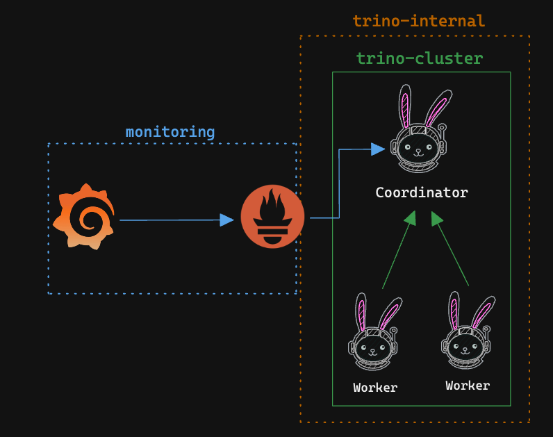

## Trino Monitoring (JMX) with Prometheus and Grafana

This repository guides you through the process of setting up monitoring for Trino JMX metrics using Prometheus and Grafana.

### Considerations

- This integration is based on the [Trino JMX metrics](https://trino.io/docs/current/monitoring-metrics.html) and the [Prometheus JMX exporter](https://github.com/prometheus/jmx_exporter)
- Trino Version: 433, Prometheus Version: v2.50.0, Grafana Version: 9.5.15

### Architecture (Docker)



### Running Trino Cluster Locally

#### Prerequisites

- Please make sure you have minimum of **8GB RAM** and **2 CPU cores** available on your machine to run the Trino cluster locally. Or you can modify the `.env` file to reduce the memory and CPU requirements.

#### Running Trino Cluster

Please modify the do

```
docker-compose up trino-coordinator trino-worker -d
```
